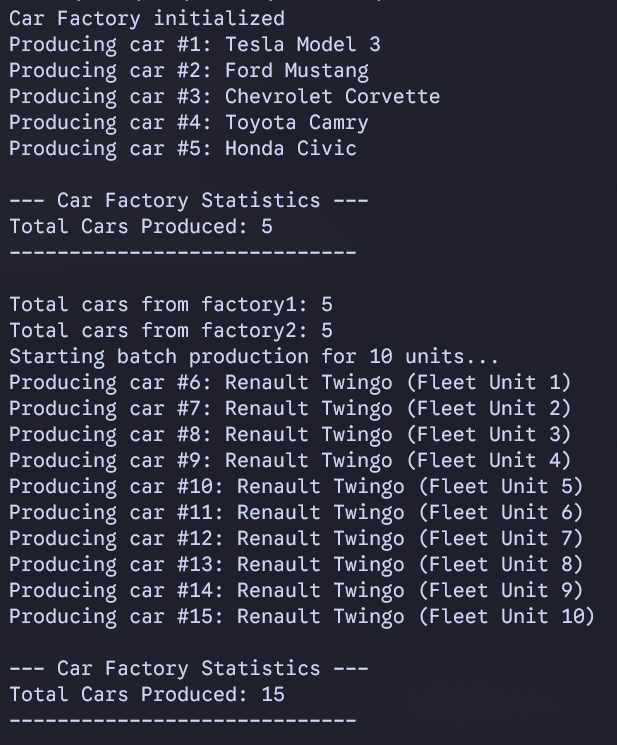

# ISW-4B26A-PATRONES-1302-SINGLETON

It's supposed to be a car factory (not the factory pattern). Maybe it needs a better name, but it ends up counting the total number of cars produced. It's not only applicable to just cars, it can work for any factory. Not the brightest idea, but it works.

Also, I am not entirely sure if whatever it prints in the console is necessary, but here is a photo:

